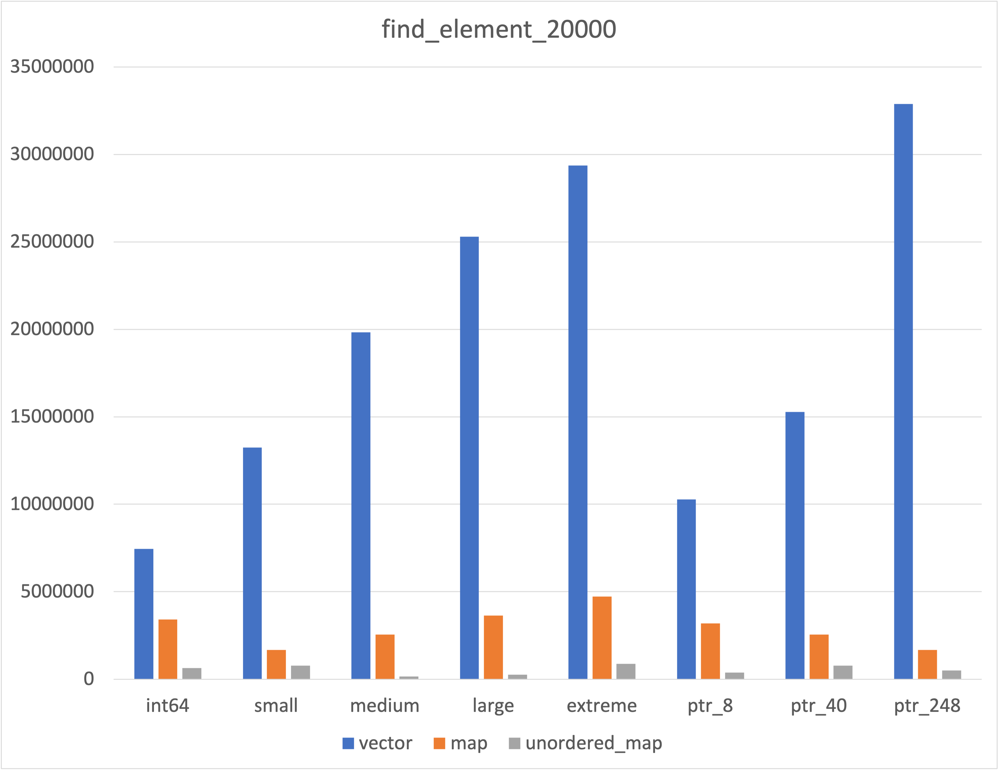
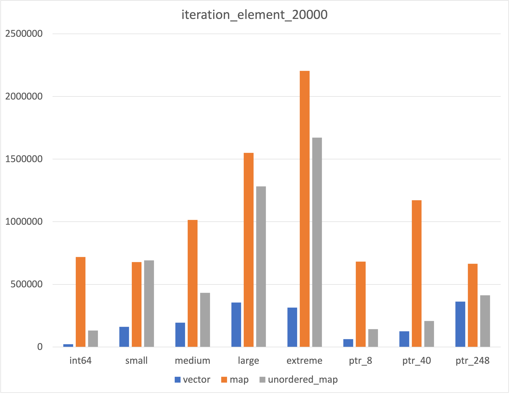

# STL container comparison  
Benchmark results of STL containers  
Works only on intel x86_64 CPUs  

~~~
Tested environment  
OS: macOS 13.3  
Compiler: Apple clang 14.0.3  
CPU: intel i9-9880HK  
RAM: 64GB  
~~~
-----
## Results  
  
  
  
